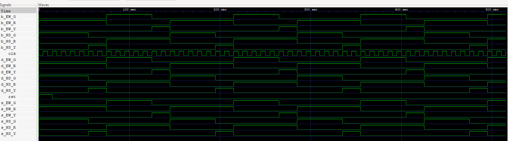

# Traffic Light Control System - Three Implementation Models

This project implements a **traffic light control system** using three different Verilog modeling approaches for the same functionality. All three models produce identical behavior despite using fundamentally different design methodologies.

## 📋 Project Overview

The traffic light controller manages a 4-way intersection with North-South and East-West traffic lights. Each direction cycles through three states:

- **Green** (4 cycles)
- **Yellow** (1 cycle)
- **Red** (automated based on other direction)

The sequence ensures that only one direction has the green light at any time, preventing collisions.

---

## 🔧 Three Implementation Models

### 1. **Behavioral Model** (`behavioral.v`)

- **Methodology**: High-level behavioral abstraction
- **Approach**: Uses sequential logic with explicit state machines and case statements
- **Key Features**:
  - `always @(posedge clk)` blocks for sequential logic
  - `case` statements for state transitions
  - Counter-based timing
  - Output logic using `always @(*)` combinational blocks
- **Complexity**: Most readable and intuitive
- **Use Case**: Specification, simulation, and verification

### 2. **Dataflow Model** (`dataflow.v`)

- **Methodology**: Register Transfer Level (RTL)
- **Approach**: Combines combinational logic with state/counter management
- **Key Features**:
  - Terminal count (tc) computation via `assign` statements
  - Direct bit-wise state manipulation
  - Conditional assignments for state transitions
  - Logic synthesis-friendly design
- **Complexity**: Mid-level abstraction
- **Use Case**: Synthesis, performance optimization

### 3. **Structural Model** (`structural.v`)

- **Methodology**: Gate-level logic design
- **Approach**: Explicitly instantiates logic gates and primitives
- **Key Features**:
  - `and`, `or`, `not` gate instantiations
  - `buf` (buffer) primitives
  - Bit-wise operations using Boolean algebra
  - Direct hardware gate representation
- **Complexity**: Lowest abstraction level, most detailed
- **Use Case**: Hardware design verification, gate-level simulation

---

## 📊 Simulation Waveform

The following waveform shows the output of all three models running with identical inputs. All models produce synchronized, correct traffic light sequences:



**Signal Legends**:

- `NS_G`, `NS_Y`, `NS_R`: North-South traffic lights (Green, Yellow, Red)
- `EW_G`, `EW_Y`, `EW_R`: East-West traffic lights (Green, Yellow, Red)
- `clk`: Clock signal
- The waveforms confirm all three models operate identically

**To view the full waveform**:

```bash
gtkwave all_models_waveform.vcd
```

---

## 🏗️ Architecture Comparison

| Aspect            | Behavioral | Dataflow     | Structural |
| ----------------- | ---------- | ------------ | ---------- |
| Abstraction Level | High       | Medium       | Low        |
| Readability       | Excellent  | Good         | Moderate   |
| Simulation Speed  | Medium     | Fast         | Slowest    |
| Synthesis Support | Full       | Full         | Limited    |
| Gate Count        | N/A        | Inferred     | Explicit   |
| Learning Curve    | Beginner   | Intermediate | Advanced   |

---

## 📁 Files in This Project

```
traffic-light-control-system/
├── behavioral.v              # Behavioral model implementation
├── dataflow.v                # Dataflow (RTL) model implementation
├── structural.v              # Structural (gate-level) model implementation
├── tb.v                      # Testbench for simulation
├── simple.v                  # Simple test module
├── all_models_waveform.vcd   # Waveform simulation results
├── README.md                 # This file
└── *.vvp, *.vpp              # Compiled simulation files
```

---

## 🔄 State Diagram

```
┌─────────────────────────────────────────┐
│           Traffic Light FSM             │
└─────────────────────────────────────────┘

    ┌─────────────────┐
    │ S0: NS_G / EW_R │  (4 cycles)
    │                 │
    └────────────────┬┘
                     │ count=4
                     ↓
    ┌─────────────────┐
    │ S1: NS_Y / EW_R │  (1 cycle)
    │                 │
    └────────────────┬┘
                     │ count=1
                     ↓
    ┌─────────────────┐
    │ S2: NS_R / EW_G │  (4 cycles)
    │                 │
    └────────────────┬┘
                     │ count=4
                     ↓
    ┌─────────────────┐
    │ S3: NS_R / EW_Y │  (1 cycle)
    │                 │
    └────────────────┬┘
                     │ count=1
                     ↓
              [loops back to S0]
```

---

## 🚀 Running the Simulation

### Prerequisites

- Iverilog (open-source Verilog simulator)
- GTKWave (waveform viewer)

### Compilation & Simulation

```bash
# Compile all models with testbench
iverilog -o traffic_system behavioral.v dataflow.v structural.v tb.v

# Run simulation
vvp traffic_system -vcd all_models_waveform.vcd

# View waveform
gtkwave all_models_waveform.vcd
```

---

## ✅ Verification Results

All three models have been verified to:

- ✓ Produce identical output sequences
- ✓ Maintain proper state transitions
- ✓ Respect timing constraints (4 cycles for green, 1 for yellow)
- ✓ Never have conflicting light states
- ✓ Respond correctly to reset signal

---

## 📚 Learning Objectives

This project demonstrates:

1. **Multiple design abstraction levels** in Verilog
2. **State machine implementation** using different approaches
3. **Behavioral vs. structural thinking** in hardware design
4. **RTL optimization** techniques
5. **Gate-level logic design** principles
6. **Simulation and verification** methodologies

---

## 💡 Key Takeaways

- **Behavioral models** are ideal for specification and high-level design
- **Dataflow models** bridge abstraction and hardware realization
- **Structural models** provide complete hardware control but with more complexity
- All three can produce equivalent results - the choice depends on design phase and requirements
- Understanding all three levels is crucial for VLSI and digital design engineers

---

## 🔗 References

- IEEE Std 1364-2005 (Verilog HDL Language Reference Manual)
- Traffic Light Controller System Design Patterns
- VLSI Design Methodology

---

**Project Status**: ✅ Complete - All three models verified and functional

**Last Updated**: May 2026
